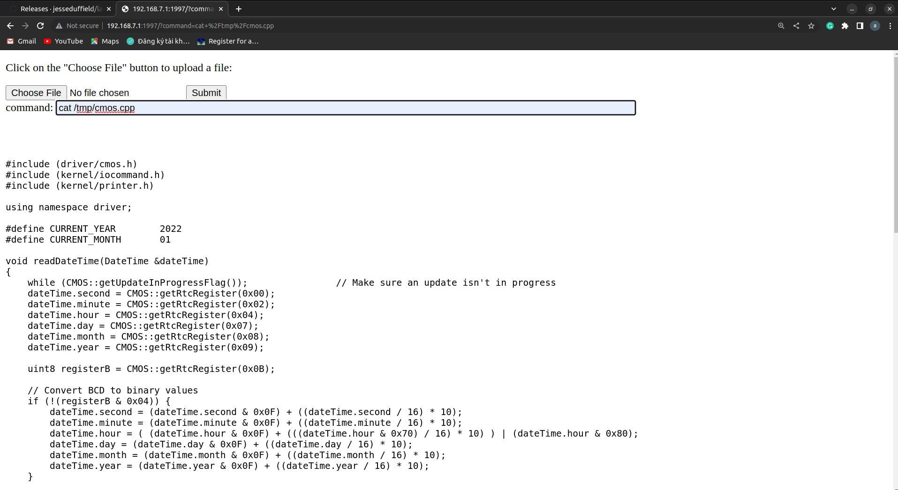

# shellcrosshttp

supported shell scripting over HTTP, upload files
you can use any supported command on host over HTTP  
example : `ls` `cp`, ...  
Topology

target <==ethernet/wifi==> host

+ step 1  
attach this binary to target and run it.  
+ step 2   
from host open 192.168.0.1:1997 on your browser

# Note  
Currently this software support chrome only.

