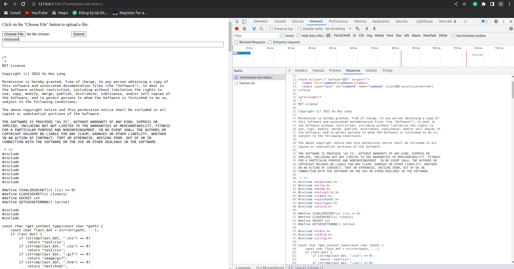

# shellcrosshttp

supported shell scripting over HTTP, upload files
you can use any supported command on host over HTTP  
example : `ls` `cp`, ...  
Topology

target <==ethernet/wifi==> host

+ step 1  
attach this binary to target and run it.  
+ step 2   
from host open 192.168.0.1:1997 on your browser

# Build & run
`make ; ./ss`

# Test
`make test`

# Install 
`make install`

# Note  
* default port is *1997*

* maximum uploaded file's size is 50Kb

* Currently this software support chrome only.

* To view original file (with some special characters in text which make html [encoded](https://www.w3schools.com/tags/ref_urlencode.ASP) -> go to inspector-> network->  response ( in raw mode if needed)

# Limitation

* Some special characters haven't displayed correctly yet -> temporarily use view response in raw mode (above)
* Don't try to use keep session shell commands like `top`, `ping`. Currently it will hang, coundn't stop it unless reboot the target or you must able to remote to the remote and restart `ss` program 
